**Report of Semester Project**

# **Point Of Sale System**

POINT OF SALE SYSTEM
1. # **Introduction**
Point of sale system is a software made for sales points to manage their businesses effectively. It gives business owners a convenient way of checking out customers and of recording sales. It can keep a record of the store inventory, updating it when an order is processed. Helps to count sales and process payments. Ensures cashiers charge the correct amount, adjusts inventory and prints receipts.
1. ## **Background**
In our country many businesses manage their business manually. They calculate their inventory manually. Doing everything manually wastes a lot of time and money. There are many chances of mistakes. To get rid of these things point of sale is very useful software.
1. ## **Problem Statement**
The project has following purpose to determine:

1. Businesses doing work manually  have chances of mistakes.
1. Most of the customers are not satisfied with this kind of businesses.	
   1. ## **Hypothesis**
There are some ideas that I proposed regarding this project.

1. It will help to businesses owners to manage their business effectively.
1. Business owners can satisfy their customers with having records of customers. 
   1. ## **Features**
Some of the useful features are given below:
1. ### **Inventory Management**
It automates the management of supply levels. Deducts inventory as sales are completes and provides alerts when inventory as sales are completed and provides alerts there is no stock in inventory.
1. ### **Manage Sales**
It manages sales of the sale point. In this way owner can manage his store matters in efficient way. It store sales records in the form of separate transactions. Owner can view all the records of sales at any time he wants.

1. ### **Security**
As owner will have its username and password so no one can view his store data. For security purpose owner cannot regenerate his password in case he forget password. In this way he will contact developer for password.

1. # **Development Tools**
The development tools I used in this project are given as follow:

- Editor Visual Studio 
- C# Programming Model
- SQL Server Database
1. # **GUI Explanation**
GUI is an important component of my project. Here is the explanation of graphical user interface used in my project.

Details of the window forms I used is given here.
1. ## **Loading Screen**
This is the starting screen of my project. It loads my project then opens the login page for further processing. Snapshot of splash screen is given at 4.1.
1. ## **Login Page**
Login page takes username and password from the user. After pressing Login button it authenticate given information from database. If given information is correct then it moves to Home Page for processing transactions. If authentication get failed it shows error message. Snapshot of login page is given at 4.2. 
1. ## **Home Page**
Home page have different buttons. In categories button you can view the list of categories. Products will show you the list of available products. Stock Update is used to update stock of any product. Sale button takes us to the sale point where we can sale our products to our customers. This page also has a Logout button. By clicking that button the log in user will be signed out and we will move back to the login page. The snapshot of Home Page is given at 4.3. 
1. ## **Categories Screen**
This screen shows all the categories of our products that we have in our store. We can delete a category by clicking on delete button available Infront of that category. We can also add new category by clicking add button. Snapshot of category screen is given at 4.4.
1. ### **Add New Category**
In this form we enter name of a new category. Then by clicking on save button new category will be saved in database and we can view it in categories list. Snapshot of add new category is given at 4.5.
1. ### **Edit Category**
If we want to edit an existing category then we have to click on edit button available Infront of that category. After changing data of that category we will click on save button to update that category.

1. ## **Products Screen**
In this screen we can view products of a specific category by selecting that category from combo box. Also sale price and available stock of that product will be showed Infront of the product. We can also delete a product by clicking on delete icon Infront of that product. We can also add new products by clicking on add button. Snapshot of product screen is given at 4.6.
1. ### **Add New Product**
To add a new product first of all we have to select a specific category. Then we have to enter product name, its sale price and its initial stock. Then after clicking on save button the product will be saved in that specific category. Snapshot of add new product is given at 4.7.
1. ## **Update Stock / Purchasing**
To update stock of a product first we will select category from combo box then we will select product name from second combo box. After available stock will be showed in a label. Then we will add number of new purchased units in quantity box of that product and   amount that we have paid for this transaction. Snapshot of update stock is given at 4.8.
1. ## **Sale Point**
Sale point is the main component of my project. In this portion we will make all the sales and the sales transactions will be stored in database. For a sale transaction first we will select category from category combo box.. Then we will select product from product combo box. After this sale price and available stock will be showed in separate labels. Then we will add number of quantity that the customer wants to buy. Then by clicking on ‘Add’ button this product will be shown in grid view. After adding all the products of this transaction. Total price will be shown in the bottom panel. Then discount will be entered that we want to give to customer. After this payable amount will be shown. We receive amount from customer and enter it in paid amount box. Then project automatically shows us the amount that we have to return to the customer in customer balance label. At the end we will press ‘Save Transaction’ button after entering remarks about this transaction. After pressing this button sale transaction will be saved in database. Snapshot of sale point is given at 4.9.

1. # **Snapshots of GUI**
Here are the some snapshots of my project.
1. ## **Loading Screen**

1. ## **Login Page**
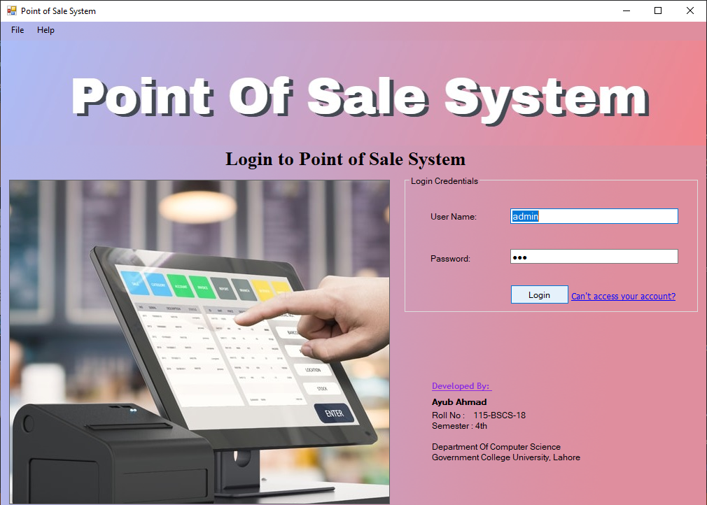
1. ## **User Home Page**
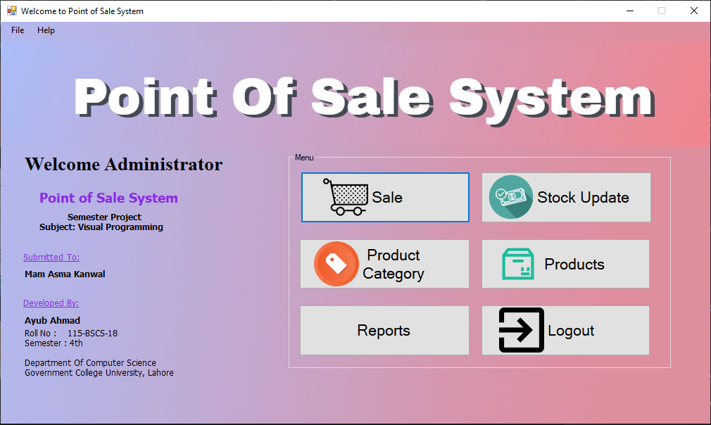
1. ## **Categories List**
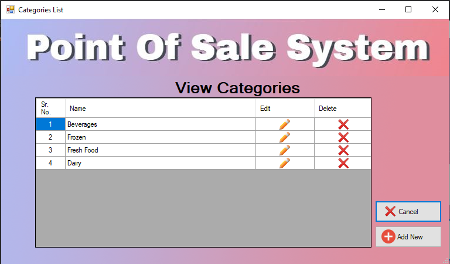
1. ## **Add New Category**
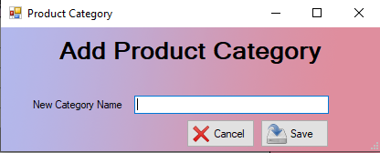
1. ## **Products List by Category**
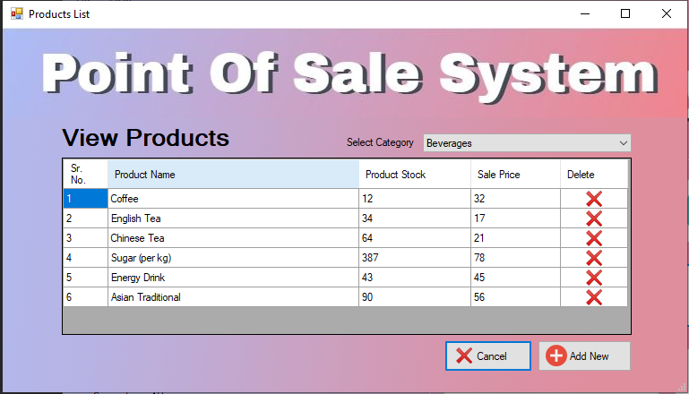
1. ## **Add New Product**
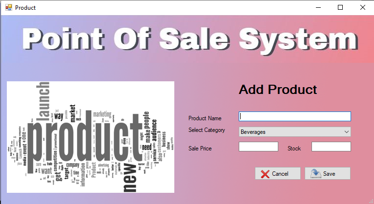
1. ## **Update Stock / Purchase**

1. ## **Sale Products**
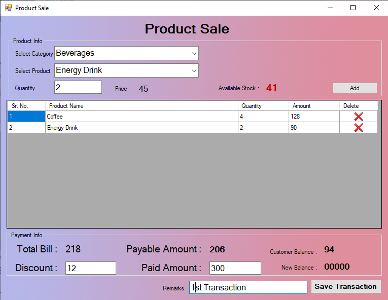

1. # **Database Explanation**
Explanation of database tables and database diagram is given below:
1. ## **Tables Explanation**
Here is the detailed discussion about my database tables.
1. ### **User**
I used this table to store username and password of users. Three columns are used in this table.

id			Primary key, auto incremented

user\_name		To store username of users

user\_password 	To store password of users

Snapshot of user table along with some data is given at 6.1.
1. ### **Categories** 
I used categories table to store all the categories of available products in the store. Two columns are used in this table.

id			Primary key, auto incremented

category\_name	To store name of the category.

Snapshot of categories table along with some data is given at 6.2.
1. ### **Products**
Products table is used to store all available products in the store according to their category id. Columns of this table are as follow:

id			Primary key, auto incremented

category\_id		Foreign key from id of category table

product\_name		To store the name of the product

available\_stock	To store the available stock in store of product

sale\_price		To store the sale price of the product  

Snapshot of products table along with some data is given at 6.3.**  
1. ### **Purchase**
When a purchase is made by the store. That purchase will be stored in purchase table and stock will be updated in product table. Columns of this table are:

id			Primary key, auto incremented

product\_id		Foreign key from id of product table

date\_time		To store date and time of the transaction.

quantity		To store quantity of specific product purchased.

paid\_amount		To store the amount paid for this transaction

Snapshot of purchase table along with some data is given at 6.4.
1. ### **Order**
When a sale a made by the store. Transaction of this sale is stored in order table. This table does not store all the detail of this transaction but only the number of products and total amount received, discount and remarks about this sale transaction. Columns of the table are given below. 

id			Primary key, auto incremented

date\_time		To store date and time of the transaction

items			To store number of items that sold in this transaction

bill\_amount		To store the amount received in this transaction

discount		To store discount given to customer 

remarks		To store remarks given by accountant about this transaction	

Snapshot of order table along with some data is given at 6.5.
1. ### **Order Detail**
This table is used to store the detail of the sale orders. In order table I store only collective amount and total number of items. But in this table I store details of all the products and amount of each product separately of all the orders.

id			Primary key, auto incremented

order\_id		Foreign key from id of order table

product\_id		Foreign key from id of product table

quantity		To store the quantity of specific product sold

price			To store the sale price of the specific product

Snapshot of order detail table along with some data is given at 6.6.

1. ## **Database Diagram**
Here is the diagram of my database and diagram explanation.

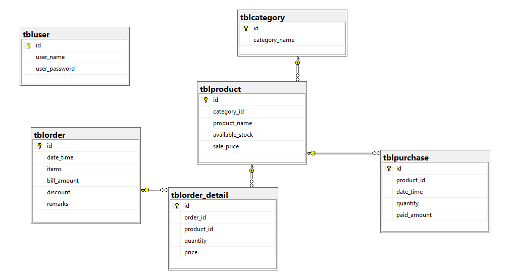

**Properties of Database Diagram**

- User table does not connected with any table
- Primary key ‘id’ from category table is foreign key in product table as ‘category\_id’
- Primary key ‘id’ from product table is foreign key in purchase table as ‘product\_id’
- Primary key ‘id’ from product table is foreign key in order detail table as ‘product\_id’
- Primary key ‘id’ from order table is foreign key in order detail table as ‘order\_id’
- All the tables of database are connected with each other except user table. 
1. # **Snapshots of Database**
Here are the snapshots of my database tables along with data.
1. ## **User**
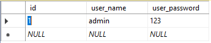

1. ## **Categories**
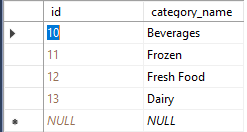
1. ## **Products**
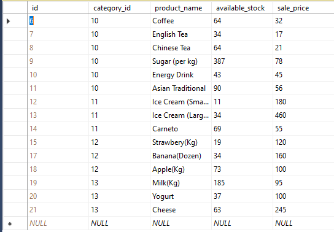

1. ## **Purchase**
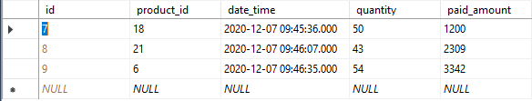

1. ## **Order**
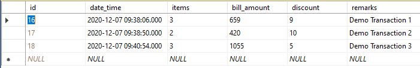
1. ## **Order Detail**
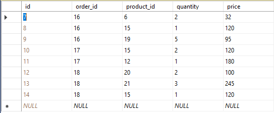
1. # **Repository Classes**
I made repository classes for making connections of my source code with my database. There are total three repository classes in my project.
1. ## **User Repository**
User repository class is used to authenticate a user when user try to login to point of sale system. Its constructor contain one parameter which is connection string.  This class contain following methods. 
1. ### **Authenticate**
This method receive two parameters username and password. Then it selects the data from user table using its parametric data. If data found in user table it returns that user along with data otherwise it returns null user.
1. ## **Category Repository**
Category repository is used to deal with categories in all the forms i.e. stock updating, sale point, categories and products table. Its constructor receives connection string as a parameter. The methods of category repository are as follow:
1. ### **Add Category**
This method is used to insert new category in database. It receives a single parameter of category name and store it in category table of my database.
1. ### **Get Id**
This method uses select query. It takes category name as parameter and return id of that category from category table.
1. ### **Get All Categories**
This method does not receive any parameter. It uses select query to get all the categories from the table. Then store them in DataTable using SqlDataAdapter and returns that data table.

1. ### **Delete Category**
This method receives category id as a parameter. Then it delete category using category query belongs to received category.
1. ### **Edit Category**
This method receives category id and updated name for a category that we want to update. After this it updates the name of category in database using update query.
1. ## **Product Repository**
Product repository is used to deal with all the products in database. It is used to handle stock updating, new products in store, sale of a product, removing a product from store. Its constructor receives connection string as a parameter. Explanation of methods is of product repository class is given below.
1. ### **Add Product**
This method receives category id, product name, available stock and sale price as parameter. Then using insert query it insert new product in product table of database. 
1. ### **Get Product by Category Id**
This method is used to get all the products of a specific category. It receives category id as a parameter. Then using select query it gets all the products by category id. Then it stores products in data table and returns that data table.
1. ### **Get Product**
This method takes product id than takes data from product table against the product id. Then store data in the object of product class and return object of product. If product does not find against that id , then method returns null object of product.
1. ### **Delete Product**
This method takes product id as a parameter. Then it deletes the record of that product with which id matches. After deleting product it returns true. If that product does not exists than it will return false. 
1. ### **Purchase** 
This method is called when store makes a purchase or when stock is updated. It receives product id, date & time, quantity of new purchased products, total stock of product after purchasing ‘ new stock’, and the amount paid for this purchasing. This method includes two different queries. First query will insert new purchasing in purchase table and the second query of update will update the available stock in product table. This method does not return anything.

1. ### **Sale**
This is the most important method of my project. It receives a list of items, discounted amount, total bill of customer, data & time and remarks that accountant want to store about this transaction. Frist it uses insert query just to insert main detail of transaction i.e. remarks, discount allowed, total number of items and amount paid by the customer. Then it contain a query of select to get the primary key id from order table of last order processed. After that it have three more quires in for each loop. The for each is used to traverse over all the products sold in this transaction. First query in loop is used to insert all the products in order detail table one by one. Second query is used to get available stock of that product in store before this sale because we have to update this stock after checking its previous availability. Third query is used to update stock after taking out the number of items sold of that specific product on which loop is currently traversing. Remember that all the three quires given above are in loop of all the products of this transaction.
1. ### **Get All Orders**
This method is used to get all the orders of that store that it makes till yet. This method does not receive any parameter. It just make a data table. Then store all the orders in this data table and return that data table because return type used for this method is data table.
1. # **Model Classes**
I have model classes in my project. Every model class is against one table in database. These are made with the purpose of getting single object from any table. If we want to return a single row data from table than we will just create an object of model class which is made for that table. We can use data from object more efficiently. I have six model classes in my project.

`	`**Class Name		Table in Database**

- User			tbluser
- Category		tblcategory
- Product		tblproduct
- Purchase		tblpurchase
- Order 			tblorder
- Order\_detail		tblorder\_detail
1. # **Requirements for Project**
Following are the requirements to run my project.

- Visual Studio 2017 or above
- Sql Server Management Studio 18

1. ## **What to do before starting?**
Frist you have to restore my database backup in your sql management studio. Steps to restore my database are:

1:	Create a new database in your sql server.

2:	Then right click on that database. Go to tasks -> Restore -> Database.

3:	Click on add button and go to folder of my project. Then to ‘Database Backup’.

4: 	Select file available in this folder and press Ok.

5:	Now you can run my project on your computer smootly.

1. # **Conclusion**
I tried my best to achieve all the goals that I have set before selecting my project topic and after that before starting my project. I focused on all the circumstances about a point of sale system. This project helped me a lot in enhancing my experience about c#, object oriented programming, graphical user interface and database. I hope you would like my point of sale system. 

